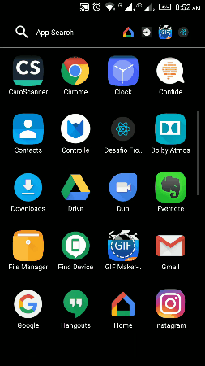

# Frontend Desafio - Agenda Edu

Teste para recrutamento de Front-ends no Agenda Edu.
O projeto é um [PWA][pwa-introduction], aonde será possível visualizar os principais repositórios de cada linguagem de programação utilizada na empresa (Ruby e Javascript), utilizando a [API do GitHub][github-api-url]. É extratamente necessário que a aplicação utilize paginação para exibição dos dados(utilizar o esquema de paginação fornecido pela [API do GitHub][github-api-url]). É necessário que seja possível favoritar repositórios e que eles sejam de fácil acesso.

## Preview

## Visão Geral

A aplicação é uma PWA desenvolvida utilizando o framework [React.js][reactjs-url], onde as requisições externas também são armazenadas no cache, ou seja, a lista de repositórios e os repositórios favoritados são armazenados em cache, caso não exista dados no cache, a API/Firebase são consultados.

É possível navegar entre duas rotas: HOME e FAVORITOS.

Para a parte de layout da aplicação foi utilizado o CSS framework baseado no Flexbox [Bulma][bulma-url] e mais alguns components para compor elementos:
- [React Infinite Scroller][react-infinite-scroller-url]
- [React Simplert][react-simplert-url]

O [Firebase][firebase-url] é utilizado tanto para hospedar a aplicação ([link][project-url]), quanto para armazenar os repositórios favoritados em seu banco real time.

[pwa-introduction]: https://developers.google.com/web/fundamentals/getting-started/codelabs/your-first-pwapp/
[github-api-url]: https://developer.github.com/v3/
[reactjs-url]: https://reactjs.org/
[bulma-url]: https://bulma.io/
[react-infinite-scroller-url]: https://github.com/CassetteRocks/react-infinite-scroller
[react-simplert-url]: https://github.com/mazipan/react-simplert
[firebase-url]: https://www.firebase.com/
[project-url]: https://desafio-frontend-67428.firebaseapp.com/
